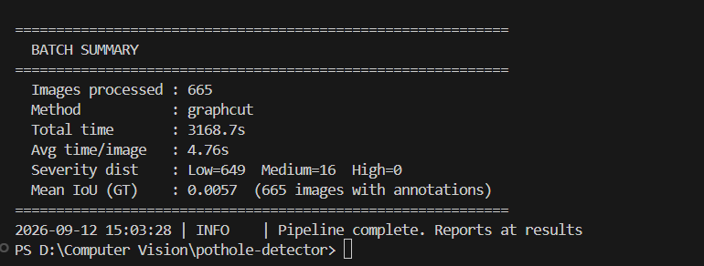
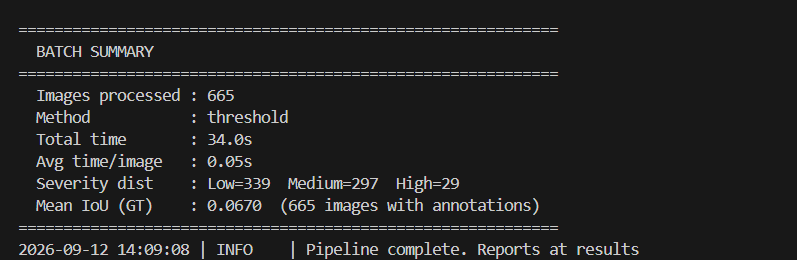

# Pothole & Road Damage Detector

## Overview
A classical computer-vision pipeline that automatically detects and quantifies pothole and road-surface damage from images. The system evaluates the severity of the damage and produces structured severity reports (CSV/JSON). This project demonstrates classical CV techniques—specifically Adaptive Thresholding and Markov Random Field (MRF) Graph-Cut segmentation—without relying on deep learning.

## Features
- **Classical Segmentation Engine**: Choose between a blazing-fast Adaptive Threshold method or a robust MRF Graph-Cut method.
- **Automated Severity Scoring**: Calculates the damage area ratio and classifies severity into Low (<2%), Medium (2-8%), and High (>8%).
- **Batch Processing & Reporting**: Processes hundreds of images at once and exports results to CSV and JSON.
- **Mask Visualization**: Optionally exports images with damage highlighted as red overlays for easy verification.
- **IoU Evaluation**: Automatically parses Pascal VOC XML annotations to compute Intersection over Union metrics against ground truth.

## Technologies/Tools Used
- **Language**: Python 3.13
- **Computer Vision**: OpenCV (`cv2`) for image processing, filtering, CLAHE contrast enhancement, and thresholding.
- **Math & Optimization**: NumPy for matrix operations, SciPy (`scipy.sparse.csgraph.maximum_flow`) for Graph-Cut energy minimization.
- **Testing**: `pytest` for unit and integration testing.

## Installation & Setup

1. **Clone and navigate to the directory**:
   ```bash
   cd pothole-detector
   ```
2. **Install dependencies**:
   ```bash
   pip install -r requirements.txt
   ```
3. **Dataset Setup**: 
   Place your input images in a directory (default: `../images/`) and Pascal VOC annotations in another (default: `../annotations/`).

## Usage & Execution

Run the pipeline using the CLI entry point `main.py`. 

**Basic Run (Fast Threshold Method):**
```bash
python main.py
```

**Graph-Cut Method on 10 images with Overlays:**
```bash
python main.py --method graphcut --max-images 10 --save-masks
```

**Custom Directories:**
```bash
python main.py --input /path/to/images --output /path/to/results --annotations /path/to/annotations
```

## Testing Instructions

The project includes a comprehensive test suite for preprocessing, segmentation, and analysis modules.
Run the tests using pytest:
```bash
pytest tests/ -v
```

## Example Outputs (Screenshots)

Below are the batch summaries generated by the CLI for both methods on a dataset of 665 images.

### Graph-Cut Method Execution


### Threshold Method Execution

